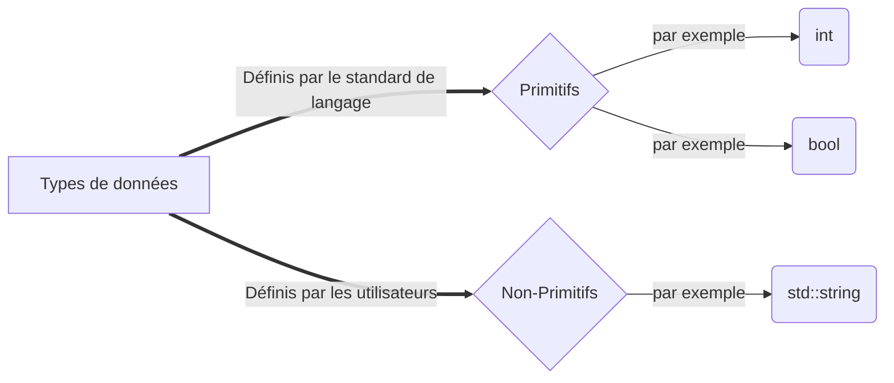

# Les variables
Un des pilliers fondamentaux de la programmation est la gestion des données. En effet, tout programme doit pouvoir storer de l'information en mémoire pour fonctionner correctement. L'outil le plus élémentaire utilisé pour parvenir à cette fin est la variable.

Une variable est comme un case qui abrite une valeur. Celle-ci est lisible et modifiable et est nommé de manière descriptive. Par contre, toutes les variables doivent avoir un seul *type de donné*. Mais, qu'est-ce qu'un type de donné?

??? abstract "Définition"

    Une variable est une case en mémoire qui contient une valeur d'un type de donné spécfique.

## Les types de données
En informatique toutes les données que nous manipulons finissent par devenir des 1 et des 0 (binaire), toutefois, lorsqu'elles se retrouvent sous des formes de représentations intermédiaires, les données peuvent être distinguées en plusieurs catégories. Logiquement, un nombre et un mot ne sont pas traités de la même manière.

Un type de donnée est un paramètre qualitatif qui exprime comment une donnée doit être traitée par le programme. En C++ on distingue deux catégories de types de données : les primitifs et les non-primitifs. Les types primitifs sont des types fournis par le langage C++ lui-même, tandis que les non-primitifs sont définis par les programmeurs, notamment dans les bibliothèques de programmes.


### Liste des types primitifs
Les types primitifs sont en majorité des types de nombres. Pour les nombres entiers on a `int` qui vient de *integer* en anglais, tandis que pour les nombres décimaux on a principalement le `double`. Il y en a d'autres qui servent principalement à avoir plus de précisions ou des nombres plus grands.


| Type de nombre | Nom du type | Intervale des valeurs|
| ----------- | ------------ | ------------ |
| Entier       |      `int`     |  ~ -2 milliards à 2 milliards|
| Entier       |      `long`     |  ~ -9 trilliards à 9 trilliards|
| Décimal       |      `float`     |  ~ -3.4 &times; 10<sup>38</sup> à 3.4 &times; 10<sup>38</sup>|

Il y a deux autres types primitifs qui eux ne sont pas des types de nombres. Le premier est le `bool` ou *booléen* qui représente une valeur qui peut être vraie ou fausse. Le deuxième est le `char` qui représente un charactère comme *a* ou *$*.
## Déclarer une variable
Maintenant que nous avons pris connaissance des variables, nous pouvons les utiliser. Pour utiliser une variable il faut d'abord la *déclarer*. Ici tentons d'afficher la valeur 2 à la console.
``` c++
#include <iostream>
int main(){

    int ma_variable; //Ici on déclare une variable de type nombre entier, qui se nomme ma_variable.
    
    ma_variable = 2; //On lui assigne ensuite une valeur (définition)

    std::cout << ma_variable << '\n'; //Ceci affiche la valeur de la variable à la console
    return 0;
}
```
Notre programme fonctionne! Par contre, une chose cloche : avant d'utiliser notre variable il nous a fallu 2 lignes de code. Une pour la *définir* et une pour l' *initialiser*. Ce n'est rien de grave, mais il existe un (même deux) raccourci qui nous permet de le faire en une ligne.

??? note "Nuance"

    La définition demande au compilateur de créer une variable en mémoire; toutefois elle contiendra une valeur abérrante. De l'autre côté, l'initialisation donne une valeur spécifique à la variable.
``` c++

    int ma_variable = 2; // Initialisation par copie.
    double nb_decimal {3.5}; //Initialisation par liste

    std::cout << ma_variable << '\n' << nb_decimal << '\n';
    return 0;


```
J'ai mentionné qu'il y avait deux méthode pour initialiser une variable en une ligne. Logiquement, on peut se demander laquelle est la meilleure. Pour l'instant, il s'agit de l'initialisation par liste, ex. `double nombre {17.5};`. Nous explorerons les détails plus loins dans les leçons, mais pour le moment on peut se contenter d'utiliser cette méthode.

!!! tip "Conseil"
    Préférez l'initialisation par liste à l'initialisation par copie