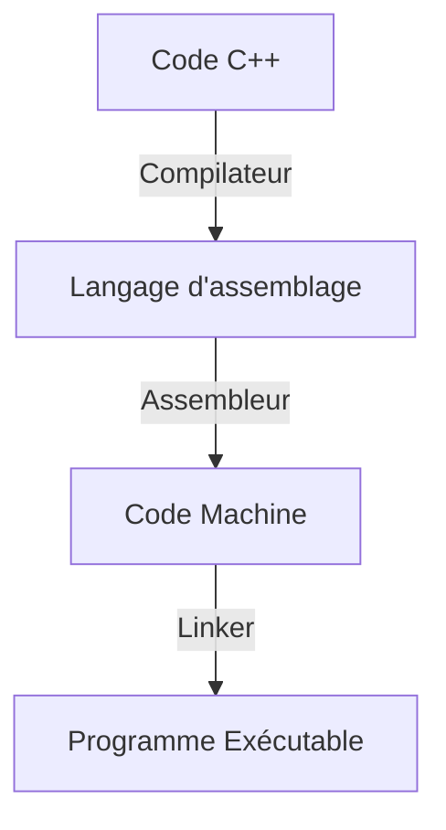

# Introduction à la programmation et au  C++

## Ces tutoriels
Le C++ est un langage de programmation qui permet de coder toutes sortes d'application comme des jeux vidéos, des logiciels de montage vidéo, des systèmes de trading quantitatif et bien plus encore!

 Dans ces tutoriels vous apprendrez diverses notions qui vous permettrons de maîtriser ce langage fort polyvalent et écrire vos propres programmes. Les notions sont réparties en plusieurs sections et chapitres qui vous permettrons d'organiser votre apprentissage.
 
  Je recommende étudier un chapitre par semaine (donc une section par mois) afin de ne pas trop s'emporter. Chaque chapitre est accompagné d'exemples de code et chaque section viens avec un petit projet question de réappliquer ses connnaisances.
## La programmation
La programmation consiste à rédiger des programmes qui peuvent être compris par l'ordinateur par l'entremise d'instructions. Au bas-niveau le processeur d'un ordinateur rends des instructions en binaire disponibles aux programmes pour qu'ils puissent effectuer une panoplie d'opération. On dit d'un programme composé de ces instructions qu'il est écrit en **langage machine**.

 Cependant, il est très impratique de coder en binaire (que des 1 et des 0), alors le langage d'assemblage a été créé. Celui-ci est directement *assemblé* en langage machine, mais reste relativement lisible aux humains comme il utilise du texte. 
 
 Malheuresement, le language d'assemblage souffre du même problème : il est encore beacoup trop difficile à utiliser, car tout doit être fait par soi-même. Alors, s'ajoute une troisième couche à ce système : le langage de haut-niveau, en l'occurence le C++. Celui-ci permet d'écrire du code en plusieurs fichiers qui seront *compilés* par le compilateur en langage d'assemblage. Nos fichier seront ensuite transformés en langage machine par l'assembleur et puis liés entre eux par le *linker*.

Bref, lorsque qu'on écrit un programme en C++, il passe sous plusieurs formes de représentations différentes avans d'atteindre le binaire.

## Le C et le C++
Lorsqu'on code en C++ il est important de savoir que ce langage de programmation a eu un prédécesseur : le C. Celui-ci a été dévelopé en 1972 par Dennis Ritchie et a été conçu pour créer des systèmes d'exploitations. Le C a été un grand succès, notamment grâce à sa philosophie qui donne plus de pouvoir au programmeur et donne donc à celui-ci toutes les responsabilitées qui viennent avec.

!!! warning "Attention"

    Lorsqu'on code en C ou en C++ il faut s'assurer que notre code est sécuritaire, comme le compilateur ne nous en donne aucune garantie!

Plus tard, en 1979, Bjarn Stroustrup a commencé le dévelopment d'un langage qui visait à enrichir le C d'une multitude de fonctionalités. Il le nomma *C++*. Celui-ci fera aussi un grand succès, étant encore mis à jour aujourd'huis. Cependant, comme le C++ reprends beacoup de fonctionalités du C et vise à en rendre plus sécuritaire, il a tendance à en être surchargé.

!!!tip "Conseil" 

    En C++ il y a souvent plusieurs manières de faire la même chose. Lorsqu'on a le choix, on préfère la version moderne à la version du C.

